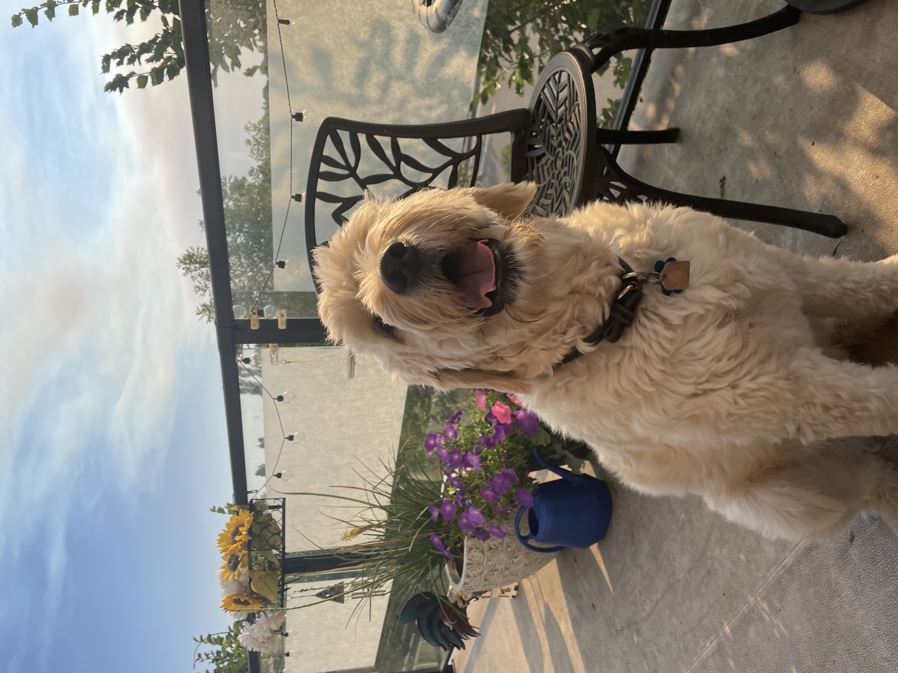
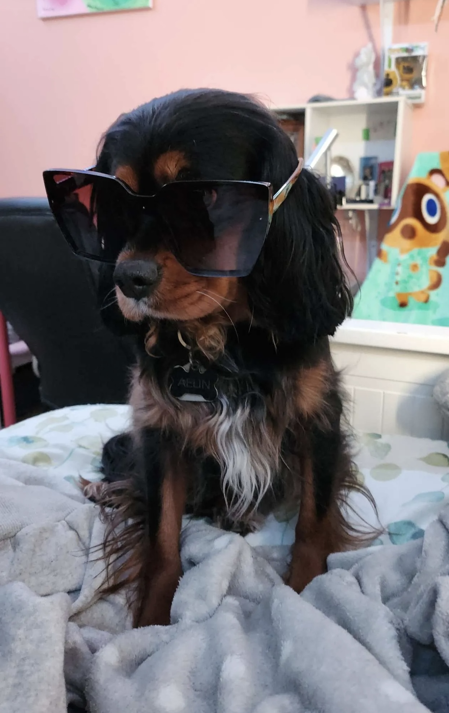

# Walking a Dog 

# NOTE : To do this you need a dog 

### Things to bring when walking a dog 
- leash
- harness
- poop bags :hankey:
- water bottle 

This is my Dog. His name is **George.**

this is my dog *Aelin*.

WOW !! so cute :heart_eyes: 

### Tips for Walking your Dog

- Avoid other dogs and people if your dog has a tendency to jump  (this can be fixed with gradual introduction to stimulus )
- Always carry extra bags you never know! 
- Switch it up every once and a while , dogs like to smell new things 
- Check the pavement or the ground to make sure its not too cold or too hot on their paws
- Consider boots or sweaters for you dog if the weather is cold or ground is not ideal

### Dog Friendly Trails
Here are some great places to walk your dog in Calgary AB: [2023 Best 10 Trails to Walk your Dog in Calgary](https://www.alltrails.com/canada/alberta/calgary/dogs-leash)

omg I can't believe aelin is already two years old!

no conflict here 🐕 

Lets meetup with our dogs and we can go to dog park. I like Sue higgens dog park in the SE. 
:sparkles:

### My fav kind of dogs are:
- Golden Retrievers 
- Shiba Inu
- Corgis
- Cane Corso 
- Weiner Dogs
